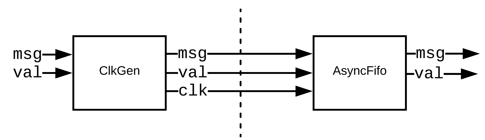
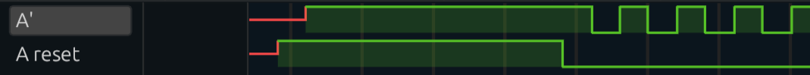
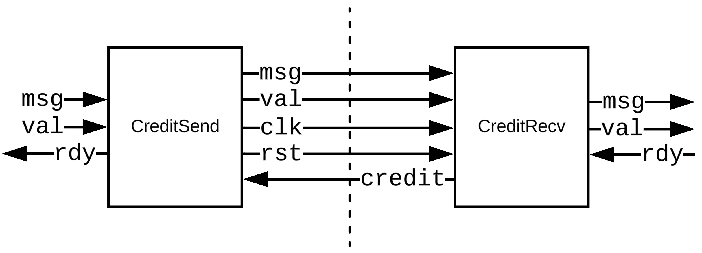
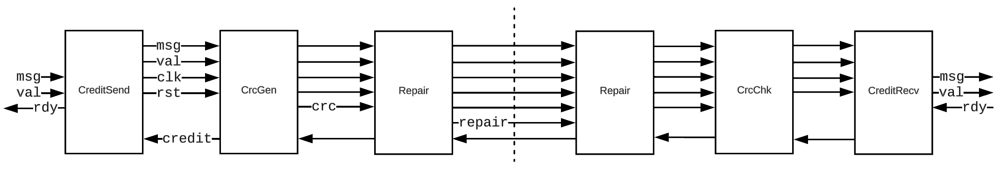
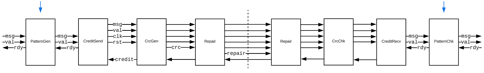
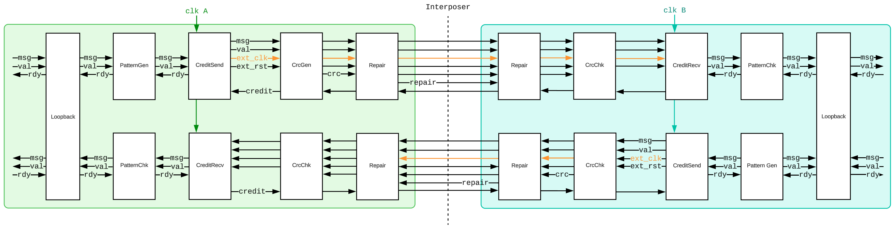
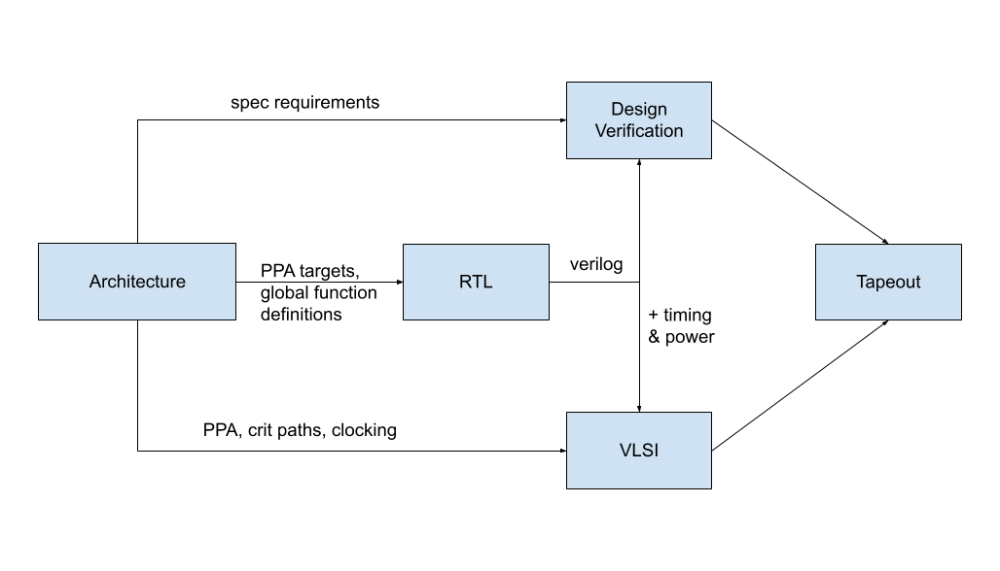

Background Information
======================

   This page is an introduction to the BRGTC6 project. It covers the design and development of the BRGTC6 chip, as well as any fundamental or tangential knowledge that may be helpful for understanding the project.

   Any outside reference that this document points to can be found in the resources section.

.. _BRGTC6Quickstart-Objective:

Objective
---------

The primary objective of the project is to build a chip-to-chip communication link that is:

-  Performant
-  Modular
-  Clean
-  Thoroughly Tested
-  Open Source

.. _BRGTC6Quickstart-Fundamentals:

Fundamentals
------------

Talking between chips requires an asynchronous design, whereas asynchronous designs are notoriously easy to mess up. An important part of the project is building correct and robust asynchronous components. We need to fully understand how the components work, and also figure out how to test them exhaustively.

.. _BRGTC6Quickstart-Metastability:

Metastability
~~~~~~~~~~~~~

Read Weste & Harris VLSI textbook Ch. 10.6.1 if you are not familiar with metastability. (A copy of the PDF is (internal attachment))

.. _BRGTC6Quickstart-Synchronizers:

Synchronizers
~~~~~~~~~~~~~

Our synchronizer impl is `HERE <https://github.com/cornell-brg/brgtc6/blob/main/src/common/Synchronizer.sv>`__.

Read Weste & Harris VLSI textbook Ch. 10.6.2 and 10.6.3 if you are not familiar with synchronizers.

.. _BRGTC6Quickstart-AsynchronousFIFO:

Asynchronous FIFO
~~~~~~~~~~~~~~~~~

Our async fifo impl is `HERE <https://github.com/cornell-brg/brgtc6/blob/main/src/asyncfifo/AsyncFifo.sv>`__.

Read `Asynchronous FIFO - VLSI Verify <https://vlsiverify.com/verilog/verilog-codes/asynchronous-fifo/>`__, and check out `BSG Async FIFO Impl. <https://github.com/bespoke-silicon-group/basejump_stl/blob/master/bsg_async/bsg_async_fifo.sv>`__

If you don't know gray code, read this two pager on gray codes `HERE <https://www.encoder.com/hubfs/white-papers/WP-2010_Gray-Codes/wp2010-gray-codes-natural-binary-codes-and-conversions.pdf?hsLang=en#:~:text=Gray%20Code%20is%20a%20form%20of%20binary%20that%20uses%20a,the%20data%20must%20be%20incorrect).>`__.

.. _BRGTC6Quickstart-Pseudo-RandomBitStream(PRBS)Generator/LinearFeedbackShiftRegister(LFSR):

Pseudo-Random Bit Stream (PRBS) Generator / Linear Feedback Shift Register (LFSR)
~~~~~~~~~~~~~~~~~~~~~~~~~~~~~~~~~~~~~~~~~~~~~~~~~~~~~~~~~~~~~~~~~~~~~~~~~~~~~~~~~

Read Weste & Harris VLSI textbook Ch. 11.5.4 if you are not familiar with PRBS or LFSR.

.. _BRGTC6Quickstart-SourceSynchronousInterface:

Source Synchronous Interface
~~~~~~~~~~~~~~~~~~~~~~~~~~~~

Read Intel's guide on source synchronous interfaces `HERE <https://cdrdv2-public.intel.com/653688/an433.pdf>`__. (It is for constraining FPGAs but very useful for understanding src-sync in general)

   Edit Sep. 7th:  In the interest of time, look at page 22 first on Center Aligned SDR output, that is closer to what we are doing.

.. _BRGTC6Quickstart-SynopsisDesignConstraints(SDC)Files:

Synopsis Design Constraints (SDC) Files
~~~~~~~~~~~~~~~~~~~~~~~~~~~~~~~~~~~~~~~

I am not an expert in them, the Intel handout on SDQ and TimeQuest for Quartus `HERE <https://cdrdv2-public.intel.com/655074/mnl_sdctmq.pdf>`__ is a good reference.

.. _BRGTC6Quickstart-Architecture:

Architecture
------------

This section will talk about the architecture and how we came to the current solution.

.. _BRGTC6Quickstart-ArchitecturalDevelopment:

Architectural Development
~~~~~~~~~~~~~~~~~~~~~~~~~

.. _BRGTC6Quickstart-ASimpleSrcSynchronousInterface:

A Simple Src Synchronous Interface
^^^^^^^^^^^^^^^^^^^^^^^^^^^^^^^^^^

|image0|

The most native way to send data from chip A to chip B with a different clk is to send a clock along with the data. Chip B can sample the data with the provided clock, and then use the async fifo to cross the signal between time domains and synchronize it with chip B's native clock.

Note that the clk that is generated by ClkGen, (we will refer to as A') would be much slower than the chip A clock because the interconnect cannot run as fast as the chips do.

This interface, however, cannot handle back pressure, if chip B's fifo fills, then any more message sent by A would fail.

.. _BRGTC6Quickstart-TheResetProblem:

The Reset Problem
^^^^^^^^^^^^^^^^^

An Async FIFO has 2 clks and resets, one for the istream, which is in sync with A', and another for the ostream, which is in sync with chip B's clock. But we can't connect the reset for chipB to the istream, because it is not synchronized with A'.

We also cannot simply connect the chip A reset to the chip B istream, because A reset would also reset the clkGen, which provides A'. In the waveform below, you can see that A reset would not have been captured by A', as A' didn't tick when A reset was high.

|image1|

.. _BRGTC6Quickstart-Credit-BasedFlowControlInterface:

Credit-Based Flow Control Interface
^^^^^^^^^^^^^^^^^^^^^^^^^^^^^^^^^^^

|image2|

To support back pressure and fix the reset problem, we have the credit-based flow control interface.

The idea of credit-based flow control is that the sending chip (chip A) would know ahead of time that the receiving chip (chip B) has a receiving buffer of size N. Then A will have N credits that it can expend to send messages to B (A can send A messages).

After those credits are exhausted, A is forbidden from sending more messages to B. Whenever B pulls out a message from that buffer, it will issue a token back to A, which allows A to send another message.

|

To solve the reset problem, we added a separate reset that is also generated by clkGen (the clkGen module is now embedded within the CreditSend module), so that the reset would act as a "start" signal and would only be pulled high after the generated clock started ticking.

These two modules now basically become an adapter from val/rdy to credit-based flow and from credit-based flow to val/rdy.

.. _BRGTC6Quickstart-CRC&Repair:

CRC & Repair
^^^^^^^^^^^^

|image3|

Now we add repairability to our interface. The CRC module will take all the msg and val signals and generate a parity bit (basically XORing them), such that if any bit is corrupted, it could be restored (by XORing all other bits).

Another issue that might occur is a dead pin or wire, to fix that, we have a repair unit, that can offset wires around the broken wire.

.. _BRGTC6Quickstart-PatternGen&Check(BIST):

Pattern Gen & Check (BIST)
^^^^^^^^^^^^^^^^^^^^^^^^^^

Another issue is validating the link. To do that we can add a BIST, a PRBS that generates data to send, and another PRBS to check the correctness. These PRBSs can be implemented simply as an LFSR, which loops over all possible combinations in a fixed rotation.

|image4|

.. _BRGTC6Quickstart-CurrentArchitecture(V1):

Current Architecture (V1)
~~~~~~~~~~~~~~~~~~~~~~~~~

|image5|

This diagram is the current architecture. We duplicated a reversed pipeline so that the link is bidirectional. We also added a loopback unit, which allows more comprehensive testing through the link.

.. _BRGTC6Quickstart-ConfigurationInterface:

Configuration Interface
^^^^^^^^^^^^^^^^^^^^^^^

There are many things that we need to configure in the chip at run time.

-  The clock divider factor in the clkGen inside CreditSend
-  Whether to enable the Patten Gen and Check BISTs or put them in bypass mode
-  Whether to enable loopback
-  The repair unit settings
-  ...

There are also many things that we need to retrieve from the chip

-  Number of CRC errors
-  Credit deadlock
-  BIST status
-  ...

The chip implements an SPI minion and a configuration interface that supports both. Configuration writes set link settings (clock division factor, BIST mode, skew adjustments, etc.) before the link is enabled, and configuration reads poll for status registers (link status, error counters, received messages, etc.). The full configuration interface is documented in :doc:`/rtl_design/config_interface`. For BRGTC6 the SPI minion is driven by an RP2040 MCU on the tester board.

.. _BRGTC6Quickstart-Codebase:

Codebase
--------

The GitHub repo for the project is `HERE <https://github.com/cornell-brg/brgtc6>`__. RTL components are organized under `src/ <https://github.com/cornell-brg/brgtc6/tree/main/src>`__ by function (``asyncfifo``, ``common``, ``config``, ``crc``, ``credit``, ``pattern``, ``repair``, ``spi``, ``top-full``). The ``fpga/`` folder contains the Quartus projects used to prototype the upstream and downstream links on the BRG ECE2300 FPGA boards.

.. _BRGTC6Quickstart-Testing:

Testing
~~~~~~~

Unit and integration tests live in ``test/`` and are driven by a CMake build. RTL simulation is run with Verilator (2-state) and Synopsys VCS (4-state); each component under ``src/`` has a corresponding unit test in ``test/unit/``, and the link-level integration tests in ``test/integration/`` exercise the SingleLink and DualLink configurations for V1 through V4. The testbench uses SystemVerilog rather than PyMTL so that asynchronous components can be exercised with multiple clock domains.

The taped-out design was also exercised on the BRG ECE2300 FPGA boards under Quartus prior to tapeout; the FPGA projects live in ``fpga/upstream_fpga`` and ``fpga/downstream_fpga``.

.. _BRGTC6Quickstart-PDK&Flow:

PDK & Flow
----------

The TSMC 65nm GP PDK is installed on the BRG server. The ASIC physical-design flow (synthesis, PnR, DRC, LVS) is maintained out-of-tree and consumes the RTL from this repo via a git submodule.

.. _BRGTC6Quickstart-DesignMethodology:

Design Methodology
------------------

This is a rough outline of the key steps that were followed to reach tapeout.

|image6|

.. _BRGTC6Quickstart-Resources:

Resources
---------

-  BRGTC6 Project Report \| `BRGTC6: Source-Synchronous Parallel Chip-to-Chip Link <https://www.csl.cornell.edu/~cbatten/pdfs/lyu-brgtc6-cureport2025.pdf>`__
-  West & Harris VLSI Textbook \| `CMOS VLSI Design A Circuits and Systems Perspective, 4th Edition (2011).pdf </download/attachments/533203303/CMOS%20VLSI%20Design%20A%20Circuits%20and%20Systems%20Perspective%2C%204th%20Edition%20%282011%29.pdf?version=1&modificationDate=1725654344106&api=v2>`__
-  VLSIVerify \| https://vlsiverify.com/
-  Bespoke Silicon Group \| `github.com/bespoke-silicon-group/ <https://github.com/bespoke-silicon-group/basejump_stl/blob/master/bsg_async/bsg_async_fifo.sv>`__
-  Graycode White Paper \| `PDF Link <https://www.encoder.com/hubfs/white-papers/WP-2010_Gray-Codes/wp2010-gray-codes-natural-binary-codes-and-conversions.pdf>`__
-  Intel/Altera Guide On Constraining and Analyzing Source-Synchronous Interface \| https://cdrdv2-public.intel.com/653688/an433.pdf
-  Intel Guide On SDC and TimeQuest \| https://cdrdv2-public.intel.com/655074/mnl_sdctmq.pdf

