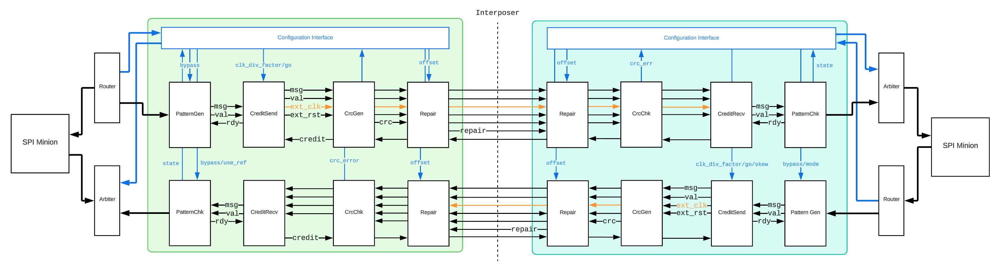

BRGTC6 Documentation
==========================================================================

This is the home for BRGTC6's documentation, covering the RTL design,
design verification, physical design, and post-silicon validation of the
BRGTC6 source-synchronous parallel chip-to-chip link.

.. _BRGTC6-ProjectDirectoryStructure:

Project Directory Structure
--------------------------------------------------------------------------

| brgtc6/
| ├─ .github/workflows/
| ├─ docs/
| ├─ fpga/
| ├─ local/
| ├─ scripts/
| ├─ src/
| │  ├─ asyncfifo/
| │  ├─ common/
| │  ├─ config/
| │  ├─ crc/
| │  ├─ credit/
| │  ├─ pattern/
| │  ├─ repair/
| │  ├─ spi/
| │  ├─ top-full/
| ├─ test/
| │  ├─ integration/
| │  ├─ unit/
| │  ├─ utils/
| ├─ README.md

.. _BRGTC6-Overview:

Overview
--------------------------------------------------------------------------

This is the home page for the BRGTC6 (Chip2Chip) project. In this project, we built a performant chip-to-chip communication interface. The taped-out test chip is a 1 mm², 200 MHz design in TSMC 65nm, and it achieved a throughput of 1.6 Gb/s at 200 MT/s in post-silicon testing.

Work in the project involved:

-  Designing a modular, performant, and open-source communication interface
-  Developing thoroughly tested RTL components
-  Setting up the TSMC 65nm PDK on the BRG server
-  Taping out a test chip in TSMC 65nm to demonstrate and validate our interface

GitHub page: `BRGTC6 Repo <https://github.com/cornell-brg/brgtc6>`__

Full project report: `BRGTC6: Source-Synchronous Parallel Chip-to-Chip Link <https://www.csl.cornell.edu/~cbatten/pdfs/lyu-brgtc6-cureport2025.pdf>`__

.. _BRGTC6-Timeline:

Timeline
--------------------------------------------------------------------------

2024
~~~~~~~~~~~~~~~~~~~~~~~~~~~~~~~~~~~~~~~~~~~~~~~~~~~~~~~~~~~~~~~~~~~~~~~~~~

-  Jun 14 - Barry Lyu started working on the project
-  Jul 25 - Initial FPGA to FPGA demo
-  Aug 05 - First full architectural draft
-  Sep 18 - Parker Schless and Vayun Tiwari joined the project

2025
~~~~~~~~~~~~~~~~~~~~~~~~~~~~~~~~~~~~~~~~~~~~~~~~~~~~~~~~~~~~~~~~~~~~~~~~~~

-  Jan 8 - V4 sent for tapeout
-  Spring - Chips received from fab
-  Chips successfully tested

.. _BRGTC6-FutureInvestigations:

Future Investigations / Revisions
--------------------------------------------------------------------------

-  Verification

   -  Encapsulate testing system as a Verilog package so that it is portable
   -  Allow for test case reuse across various modules
   -  Handle build dependencies (do not recompile if nothing changed) for Verilator tests - see Aidan McNay's Blimp project

-  RTL

   -  Use modports and interfaces to encapsulate val/rdy and credit signals

-  PD

   -  Add different standard views each configurable via a yaml file (e.g. for different corners, threshold voltages, etc.)
   -  Support different MMMC corners during PnR

.. toctree::
   :maxdepth: 2
   :caption: Background Information

   background

.. toctree::
   :maxdepth: 2
   :caption: RTL Design

   rtl_design/rtl_design
   rtl_design/design_overview
   rtl_design/config_interface

.. toctree::
   :maxdepth: 2
   :caption: Design Verification

   verification/verification
   verification/integration_tests
   verification/test_environment

.. toctree::
   :maxdepth: 2
   :caption: Post-Silicon Validation

   post_silicon/daughter_boards
   post_silicon/tester_board
