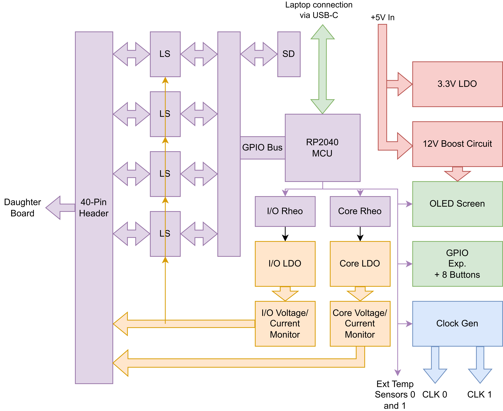

Tester Board
============

.. contents::
   :local:
   :depth: 2

.. _TesterBoard-Abstract:

Abstract
--------

The Chip Tester board is a fully-integrated test platform designed to interface with any arbitrary daughter board implementing a standard 40-pin GPIO connector. The main features include an easily-programmable RP2040 microcontroller, two independent and configurable voltage channels, voltage, current, and temperature monitoring, OLED screen data readouts, on-board buttons for user test/parameter selection, SD card support, two external SPI channels, 27 GPIO pins, and a dual-channel configurable clock generator up to 200 MHz. The entire tester board requires only a 5V input which can be provided over the USB connection to the RP2040, through the barrel connector, or the test point. All other required voltages are generated by on-board components. Modular software components for intuitive usage of the various components on the board are written in standard C with the RP2040 SDK, including a simple methodology for writing test vectors to be sent over SPI.

.. _TesterBoard-DesignRequirements:

Design Requirements
-------------------

-  Compact board design with mounting holes on all four corners to secure to a baseplate for demo purposes
-  Simple SPI communication for an arbitrary bitwidth, including ability for direct SPI passthrough as well as automated testing
-  Access to as many GPIO pins on the RP2040 as possible for largest compatibility with future boards
-  Ability for control of board via laptop communication over USB, as well as laptop-less demo abilities as a standalone test platform

.. _TesterBoard-High-LevelDescription:

High-Level Description
----------------------

|image0|

A block diagram for the Tester Board is seen above. The RP2040 has 27 of its GPIO pins (2-29) available directly on the 40-pin connector via level shifters (LS) that adjust the signals to the same voltage level as the programmed I/O voltage. To allow for maximal GPIO usage, all peripheral devices and sensors are connected via I2C on GPIO 0 and 1 of the RP2040 (connections seen in thin purple lines). The I/O and Core voltage channels are configured via digital rheostats whose values are written to by the RP2040. This programming changes the value of its resistance, thus affecting the feedback voltage on the low dropout regulators (LDO) which directly convert the 5V input voltage to the programmed voltage. These voltages are available on dedicated pins on the 40-pin connector. Voltage and current monitors also interface with these voltage channels to measure power consumption of the devices under test. A fixed 3.3V LDO and 12V boost converter circuit are also employed on the board which convert from the 5V input. The 12V circuit is used to power the OLED screen, which is controlled via the I2C bus from the RP2040. The eight buttons used for interacting with the RP2040 are available via an I2C-enabled GPIO expander so that the RP2040 GPIO's are not used for them. The clock generator is also controlled over the I2C bus and outputs both channels directly to on-board SMA connectors. Support for external temperature sensors utilizing I2C is also available via dedicated JST connectors on the board. Finally, an optionally-enabled SD card is available on the RP2040 GPIO's, and can be enabled or disabled with dedicated DIP switches on the Tester Board.

.. _TesterBoard-DetailedHardwareDescription:

Detailed Hardware Description
-----------------------------

.. _TesterBoard-RP2040Microcontroller:

RP2040 Microcontroller
~~~~~~~~~~~~~~~~~~~~~~

The RP2040 is a 7x7mm QFN-56EP IC developed by Raspberry Pi for use on their Pi Pico series boards. While the Pi Pico in its entirety could have been used for this project and soldered directly to a custom PCB, we desired the ability to have access to as many GPIO's as possible to provide the widest range of compatibility with possible daughter boards. The Pi Pico board uses a number of these pins for internal functionalities such as LEDs that are not required on this board. As such, the RP2040 itself was directly used for this project with all peripheral circuitry directly implemented on the custom PCB. We used the "Hardware design with RP2040" guide (see Appendix) for required components, peripheral circuitry, and layout considerations when implementing the RP2040. Specifically, we selected the ABM8-272-T3 crystal as recommended by the hardware guide for the external oscillator used by the RP2040 for its clock signal. We also used the W25Q128JVSIQ flash memory IC from Winbond for our external memory component that communicates to the RP2040 via a QSPI (quad-SPI) channel. This specific part is 128 Mb in size, which is the maximum that can be used by the RP2040. A standard Pi Pico only uses a 16 Mb variant of this memory IC, again highlighting the benefits of implementing our own RP2040 circuitry. Additional RESET and BOOTSEL buttons are implemented for resetting and programming the RP2040 over USB, which supports 2.0 speeds. A standard Pi Pico uses a Micro-USB connection, but we opted to use a USB-C connector for wider compatibility. The only required change for this was to implement 5.6k pulldown resistors on the CC (current control) pins on the USB-C connector so that the host is aware that the Tester Board is a downstream device. A standard USB-C connector includes 24 pins as it can typically support 3.0 speeds. However, our 2.0 connection only required the D+, D-, VBUS (for input power), GND, and CC pins to be connected. Both sides of the connector are wired so that the USB-C cable can be plugged in either way as one would expect. The hardware guide is careful to mention that the 90 ohm characteristic impedance between the D+ and D- pins from the RP2040 to the USB connector is required, which is checked using Altium's built-in impedance calculator. Reducing noise is also necessary for USB signals, so a ground plane is placed under all USB traces on the board, as well as making sure the D+ and D- traces are length-matched and kept as short as possible. A 3-pin debug connector is also implemented for use with the official Pi Pico debugger. The RP2040 has a built-in 3.3V LDO, but it can only supply a limited amount of current. Instead, we implement an external 3.3V LDO (NCP1117ST33T3G) that can provide up to 1A of current for use by all the peripheral devices. This LDO has a fixed output of 3.3V and uses an input of 5V. While 5V can be provided directly over the USB connection, it can also be provided directly by the barrel connector (with which the WSU050-4000-R power supply is recommended) or by the hook-style test points.

.. _TesterBoard-GPIOandLevelShifters:

GPIO and Level Shifters
~~~~~~~~~~~~~~~~~~~~~~~

The RP2040 has 29 available GPIO pins directly available from the QFN package. One of our design requirements was to maximize this as much as possible, so all peripheral devices on the Tester Board communicate using a single I2C bus on GPIO 0 and 1, meaning the rest of the 27 GPIO's are available for use directly to the 40-pin connector. The RP2040 GPIO's operate at a fixed 3.3V, but when interfacing with a daughter board implementing custom chips, the I/O voltage required may be different (e.g. 1.8V, 2.5V, etc. are common I/O voltages for TSMC processes). To account for this, we implement TXS0108EPWR bidirectional level shifters that convert digital signals to the respective voltages on either side. Therefore, both GPIO inputs and outputs as configured in the RP2040 software are compatible with the arbitrary I/O voltage required for a given chip. Of important note is that GPIO's 2-5 are used for SPI channel 0 and GPIO's 10-13 are used for SPI channel 1 if used a specific chip, and thus cannot be used as a standard GPIO pins if SPI is used in software. These SPI connections are available directly on the 40-pin connector, but are also available on dedicated 4-pin JST connectors on the board. In addition, GPIO's 19-23 are used for the SD card's QSPI channel if enabled, again meaning they cannot function as standard GPIO pins if the SD card is used.

.. _TesterBoard-ConfigurableLDOsandRheostats:

Configurable LDOs and Rheostats
~~~~~~~~~~~~~~~~~~~~~~~~~~~~~~~

Since we want to support as many daughter boards and chip designs as possible, as well as to perform tests where we vary the voltages, we include two independent and configurable voltage channels suitable for chips using a common ground for both I/O and core voltages (note that this tester board is NOT suitable for chips using multiple grounds). We use the TLV76701DRVR LDO which utilizes a feedback voltage pin whose voltage is controlled by an external resistive voltage divider. By replacing the upper resistor with the MCP4562-103E/MS digital rheostat which implements a digitally-controlled resistor via I2C, we can easily control the output voltage of the LDO. With the configuration implemented, each LDO is able to generate a voltage in the range of 0.55V to 3.4V given the input voltage is a steady 5V. The values of the resistors are calculated using the feedback voltage equation as found in the LDO datasheet, and ensuring the full-scale range of the digital rheostat is able to support the maximum voltage desired. Additionally, we wanted the ability for the digital rheostats to initialize to a programmed value upon startup of the board so that I/O and core voltages do not have to be programmed every time. The MCP4562 has a nonvolatile memory that can be written via a dedicated I2C register, and thus programmed via the RP2040's software.

.. _TesterBoard-VoltageandCurrentMonitors:

Voltage and Current Monitors
~~~~~~~~~~~~~~~~~~~~~~~~~~~~

As we want to measure power consumption on both the I/O and core channels, we use INA220AIDGST voltage/current monitors which use a shunt resistor to measure voltage. The value of the shunt resistor (40 mOhm) has been chosen based on the calculation in the datasheet for a maximum current of 1A on both channels. This specific IC also calculates power directly and outputs it to a register, thus allowing for easy power measurement without having to perform the calculation in the RP2040's software. Both channels use an identical sensor, but with the address pins different so that each can be communicated with individually over the I2C bus. The voltage measurement is taken on the output side of the shunt resistor to account for any voltage drops across it, but such small currents for this application would mean any such voltage drops are negligible anyway.

.. _TesterBoard-OLEDScreen:

OLED Screen
~~~~~~~~~~~

The Tester Board should be able to run independently without a laptop for demo programs. As such, a way to read out data is required. This is accomplished using the EA OLEDM204-GGA character OLED display, which supports four lines with 20 characters each. The screen can be easily written to and controlled over I2C. A 12V supply voltage is required, so a custom-designed 5V to 12V boost converter circuit is implemented on the Tester Board. Such a circuit was constructed using TI's Webench power simulator which gave us the specific boost controller to use (LM2735XMF/NOPB) as well as peripheral passive components. The layout was also provided by Webench to minimize loops and thus noise in the circuit.

.. _TesterBoard-GPIOExpanderandExternalButtons:

GPIO Expander and External Buttons
~~~~~~~~~~~~~~~~~~~~~~~~~~~~~~~~~~

Usually, a standard button would be connected to a single GPIO pin on a microcontroller. However, we wanted our Chip Tester to have many buttons that could be configurable based on the user's software needs. We have a total of eight buttons on the board, meaning we would need eight GPIO pins to accommodate them all. Instead, we used the TCA6408 GPIO expander which implements eight configurable input or output pins which can be read/written to over I2C. Therefore, we can utilize the same I2C bus that is used for all other peripheral devices on the board.

.. _TesterBoard-ClockGenerator:

Clock Generator
~~~~~~~~~~~~~~~

Part of having a fully-integrated test platform is having the ability to generate clock signals directly on the Tester Board. To accomplish this, we use the SI5351A-B-GTR clock generator IC from Skyworks, which we have configured to operate two independent clock channels up to 200 MHz each. The SI5351 communicates over I2C to the RP2040, with ground-shielded traces going out to dedicated SMA connectors to connect to the daughter board.

.. _TesterBoard-SDCard:

SD Card
~~~~~~~

SD card support is enabled through GPIO 18-23 using a QSPI (quad-SPI) protocol as described in the hardware design guide for RP2040. Since we do not always want this SD card enabled, dedicated DIP switches on the Tester Board itself are included which connect/disconnect the SD card traces to the GPIO pins. If they are not connected, GPIO 18-23 can be used as standard GPIO out to the 40-pin connector. This feature remains untested.

.. _TesterBoard-ExternalTemperatureSensor:

External Temperature Sensor
~~~~~~~~~~~~~~~~~~~~~~~~~~~

The TMP102 breakout board from Sparkfun can be plugged into the 6-pin JST connectors on the Chip Tester board to allow for remote temperature sensing. Note that the I2C pullups should be desoldered from the breakout board since the Chip Tester board already implements them. The Chip Tester board also sets the address pins appropriately so that each temperature sensor can be addressed separately on the shared I2C bus. This feature remains untested.

.. _TesterBoard-DetailedSoftwareDescription:

Detailed Software Description
-----------------------------

.. _TesterBoard-FileStructureandHierarchy:

File Structure and Hierarchy
~~~~~~~~~~~~~~~~~~~~~~~~~~~~

The primary goal of the Chip Tester software is to provide a robust, yet flexible base for creating specialized test programs for any given tapeout. This is accomplished by separating out the implementation details of individual board components such as the clock generator and voltage/current sensors from the testing infrastructure, so that component-specific functions can be generalized in the more specific test programs. For instance, the OLED screen commands are encapsulated in the oled_m204.c file with functions such as init_oled(), oled_write_text(), and oled_row_sel().

.. _TesterBoard-Chip_Tester.c:

Chip_Tester.c
~~~~~~~~~~~~~

While the entirety of the Chip Tester firmware is designed to be customizable using the provided component-specific functions, the existing main() function in Chip_Tester.c is written as a template that can be added on to for user-specific features as desired. A two-core setup is used, where core 0 monitors for on-board button presses, updates the OLED screen accordingly, and runs the specific test vector, while core 1 monitors the USB connection using the TinyUSB (tusb) library and parses the inputs to run tests, set SPI parameters, set clock frequencies, etc.

.. _TesterBoard-BitwiseSPITransfers:

Bitwise SPI Transfers
~~~~~~~~~~~~~~~~~~~~~

The RP2040 has two built-in hardware SPI modules with dedicated functions to call them, but these can only operate at the byte-level. Many tapeouts implementing the Verilog SPI minion operate using an arbitrary bitwidth, meaning having a software SPI library that can operate using an arbitrary bitwidth would be advantageous as padding would not have to be considered. This is done in the bitwise_spi.c file which implements similar read, write, and read/write functions as the built-in module, but manually toggles the SPI pins as GPIO pins to implement the protocol directly. The bitrate and number of bits can be set explicitly in software. The Verilog SPI minion uses the highest two bits to convey whether the message is a write and/or read message for transmissions to the DUT, as well as to convey val/rdy status for transmissions received from the DUT. The semantics for this microprotocol are handled in the read/write functions so the caller does not have to worry about it.

.. _TesterBoard-ClockGenerator.1:

Clock Generator
~~~~~~~~~~~~~~~

The clock generator has a large number of registers that need to be written to configure each channel for the appropriate frequency. Skyworks luckily provides a software (ClockBuilder Pro - see Appendix) which can generate the list of registers and their associated values directly given user-specified parameters. The si5351.c file directly sets these registers based on the values determined by the software.

.. _TesterBoard-Chip-SpecificTesting:

Chip-Specific Testing
~~~~~~~~~~~~~~~~~~~~~

When testing a specific chip, a new subdirectory should be made which includes the top-level test .c file as well as any chip-specific defines in a utilities .h file. In the .c file, a series of constant arrays should be defined which include the desired SPI messages to be sent in order. Such arrays can then be called in defined test functions which loop through each element in the array, write it over SPI, check that the response is correct, and possibly write the information to the OLED screen and over USB. A decoder function may also be useful which essentially "pretty-prints" the raw SPI message in a human-readable format. See the brgtc6_test/ directory for an implementation of tests and test vectors for the BRGTC6 tapeout.

.. _TesterBoard-Laptop-SideCommunicationScript:

Laptop-Side Communication Script
~~~~~~~~~~~~~~~~~~~~~~~~~~~~~~~~

When communicating to the Chip Tester board over USB, a standard serial monitor interface can be used. However, an included Chip_Tester.py Python script can alternatively be run in the terminal to provide a user-friendly wrapper around the serial monitor interface to the board. Serial data received over USB will be printed to the console in real time, and characters typed into the serial monitor will be received by the board in real time.

.. _TesterBoard-BoardUserManual:

Board User Manual
~~~~~~~~~~~~~~~~~

The user manual for the Chip Tester is in the `README.md <http://README.md>`__ document in the repository, which should be updated accordingly for a specific implementation of the software.

.. _TesterBoard-CurrentStatus/KnownIssues:

Current Status/Known Issues
---------------------------

-  The reset pin of the OLED screen is tied to a constant 3.3V. However, this pin should be connected to a GPIO pin of the microcontroller to ensure a consistent voltage on startup. This issue was thought to have caused the problem of the OLED sometimes not turning on when the board is plugged in, but an attempted fix by manually connecting the reset pin to one of the pins on the GPIO expander and setting it as an output did not resolve this. Further investigation is required to determine the true cause of this issue, but this correction should be made regardless in the next iteration of the board.
-  The clock generator sometimes does not generate signals on initial startup of the board. Further investigation for this issue is required.
-  SD card support is untested.
-  Testing BRGTC6 with the Chip Tester board revealed the necessity of being able to turn the voltage channels on and off via software instead of having to turn off the entire board. This can be fixed in the next iteration of the board by adding a second GPIO expander which controls MOSFETs on each of the channels.
-  Remote temperature sensor support is untested.

.. _TesterBoard-Appendix/Links:

Appendix/Links
--------------

-  `Altium Designer Chip Tester Board Source Files <https://github.com/cornell-brg/brg-test-board>`__
-  `Tester Board Firmware Repository <https://github.com/cornell-brg/brg-chip-tester>`__
-  `Hardware Design with RP2040 <https://datasheets.raspberrypi.com/rp2040/hardware-design-with-rp2040.pdf>`__
-  `RP2040 Datasheet <https://datasheets.raspberrypi.com/rp2040/hardware-design-with-rp2040.pdf>`__
-  `ABM8-272-T3 Datasheet <https://mm.digikey.com/Volume0/opasdata/d220001/medias/docus/6536/ABM8_Datasheet.pdf?_gl=1*2fli1s*_up*MQ..*_gs*MQ..&gclid=CjwKCAjwzMi_BhACEiwAX4YZUMl2vcy_K98GzeB90vLghNB-YN5Jk0LTWTXPIGo0_2VPrGVGqMYNWxoCfokQAvD_BwE&gclsrc=aw.ds>`__
-  `W25Q128JVSIQ Datasheet <https://www.winbond.com/resource-files/W25Q128JV%20RevI%2008232021%20Plus.pdf>`__
-  `NCP1117ST33T3G Datasheet <https://www.onsemi.com/pdf/datasheet/ncp1117-d.pdf>`__
-  `TLV76701DRVR Datasheet <https://www.ti.com/lit/ds/symlink/tlv767.pdf?HQS=dis-dk-null-digikeymode-dsf-pf-null-wwe&ts=1747126861712&ref_url=https%253A%252F%252Fwww.ti.com%252Fgeneral%252Fdocs%252Fsuppproductinfo.tsp%253FdistId%253D10%2526gotoUrl%253Dhttps%253A%252F%252Fwww.ti.com%252Flit%252Fgpn%252Ftlv767>`__
-  `MCP4562 Datasheet <https://ww1.microchip.com/downloads/en/DeviceDoc/22107B.pdf>`__
-  `LM2735XMF/NOPB Datasheet <https://www.ti.com/lit/ds/symlink/lm2735.pdf?HQS=dis-dk-null-digikeymode-dsf-pf-null-wwe&ts=1742697208653&ref_url=https%253A%252F%252Fwww.ti.com%252Fgeneral%252Fdocs%252Fsuppproductinfo.tsp%253FdistId%253D10%2526gotoUrl%253Dhttps%253A%252F%252Fwww.ti.com%252Flit%252Fgpn%252Flm2735>`__
-  `TXS0108EPWR Datasheet <https://www.ti.com/lit/ds/symlink/txs0108e.pdf?ts=1744120961309&ref_url=https%253A%252F%252Fwww.ti.com%252Fproduct%252FTXS0108E%253Futm_source%253Dgoogle%2526utm_medium%253Dcpc%2526utm_campaign%253Dasc-int-null-44700045336317926_prodfolderdynamic-cpc-pf-google-ww_en_int%2526utm_content%253Dprodfolddynamic%2526ds_k%253DDYNAMIC+SEARCH+ADS%2526DCM%253Dyes%2526gclsrc%253Daw.ds%2526gad_source%253D1%2526gclid%253DCjwKCAjwktO_BhBrEiwAV70jXvZeqfO52Z1axUkZvC08JXUWL15cI3MtCh14Nqrq3cE2kTCQ3FBnFBoCC4oQAvD_BwE>`__
-  `INA220AIDGST Datasheet <https://www.ti.com/lit/ds/symlink/ina220.pdf?ts=1748101884727>`__
-  `SI5351A-B-GTR Datasheet <https://www.skyworksinc.com/-/media/Skyworks/SL/documents/public/data-sheets/Si5351-B.pdf>`__
-  `ClockBuilder Pro Download <https://www.skyworksinc.com/Application-Pages/Clockbuilder-Pro-Software>`__
-  `EA OLEDM204-GGA Datasheet <https://www.lcd-module.de/fileadmin/html-seiten/eng/pdf/doma/oledm204-ae.pdf>`__
-  `TCA6408 Datasheet <https://www.ti.com/lit/ds/symlink/tca6408a.pdf?HQS=dis-dk-null-digikeymode-dsf-pf-null-wwe&ts=1742745339343&ref_url=https%253A%252F%252Fwww.ti.com%252Fgeneral%252Fdocs%252Fsuppproductinfo.tsp%253FdistId%253D10%2526gotoUrl%253Dhttps%253A%252F%252Fwww.ti.com%252Flit%252Fgpn%252Ftca6408a>`__
-  `TMP102 Breakout Board <https://www.sparkfun.com/sparkfun-digital-temperature-sensor-breakout-tmp102.html>`__

|

|

|

