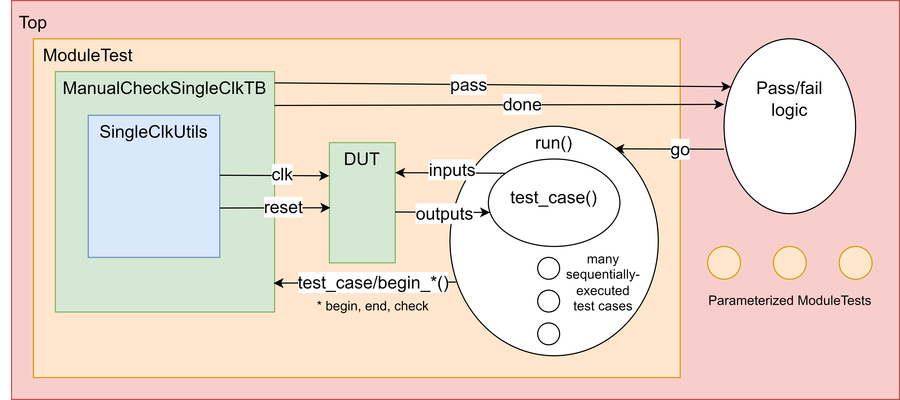
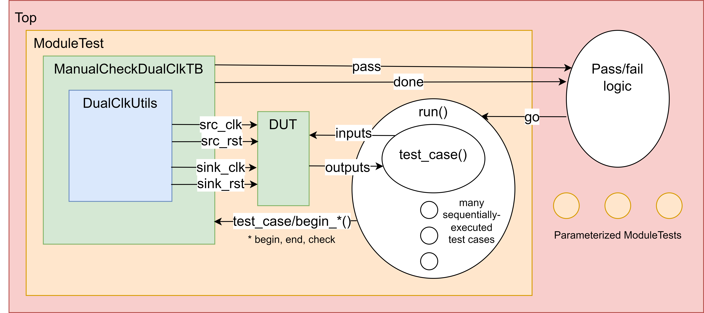

Test Environment/Infrastructure
===============================

.. contents::
   :local:
   :depth: 2

.. _TestEnvironment/Infrastructure-TestbenchStructure:

Testbench Structure
-------------------

-  Each ``-test``  file starts with a top-level module ``Top`` which contains a generate statement for each of the parameterized tests along with pass/fail logic to ensure the testbench only ends when each parameterized test finishes
-  Each parameterized test module contains its own instance of the testbench used, a DUT instance, a main ``run()`` task which executes each of the test cases tasks in series and updates the testbench with the pass/fail status
-  The specific testbench module used can vary between automated val/rdy handling as well as the number of clocks needed for the DUT (one or two), it contains functions for starting and ending the testbench, starting and ending individual test cases, recording of the pass/fail results, as well as utilities to dump VCD files when the appropriate plusargs are provided
-  Within each testbench is a clock utility module that again has two variations depending on the number of clocks used, it is able to generate clock signals, generate reset signals with provided delays, reliably change the clock period on-the-fly, as well as handle testbench timeouts

.. _TestEnvironment/Infrastructure-UnitTests-SingleClock:

Unit Tests - Single Clock
~~~~~~~~~~~~~~~~~~~~~~~~~

-  Val/Rdy signals are controlled manually by the individual test case as part of the inputs and outputs in the diagram, checking must be manually done through a function call to the testbench

|image0|

.. _TestEnvironment/Infrastructure-UnitTests-DualClocks:

Unit Tests - Dual Clocks
~~~~~~~~~~~~~~~~~~~~~~~~

-  Val/Rdy signals are controlled manually by the individual test case as part of the inputs and outputs in the diagram, checking must be manually done through a function call to the testbench

|image1|

.. _TestEnvironment/Infrastructure-IntegrationTests-SingleLink:

Integration Tests - Single Link
~~~~~~~~~~~~~~~~~~~~~~~~~~~~~~~

-  Automated ``TestSource`` and ``TestSink`` modules handle the Val/Rdy interfaces, while the test cases only set knobs in the testbench as well as in the testing elements such as artificial skew and error injectors, checking is done automatically by the sources and sinks

|image2|

.. _TestEnvironment/Infrastructure-IntegrationTests-DualLinks:

Integration Tests - Dual Links
~~~~~~~~~~~~~~~~~~~~~~~~~~~~~~

-  Automated ``TestSource`` and ``TestSink`` modules handle the Val/Rdy interfaces, while the test cases only set knobs in the testbench as well as in the testing elements such as artificial skew and error injectors, each link has its own clock and pair of source and sink while communicating through two credit interfaces for full-duplex communication, checking is done automatically by the sources and sinks

|image3|

|

.. _TestEnvironment/Infrastructure-TestingModesandRunningTests:

Testing Modes and Running Tests
-------------------------------

-  Verilator and VCS are supported by this verification infrastructure. Verilator is used for basic 2-state simulation, coverage generation, and GitHub Actions regression testing, while VCS is used for more advanced 4-state simulation, FFGL, and BA testing
-  ``build/`` must be created manually with ``mkdir -p build`` while in the ``test/`` directory
-  Run outputs will show each test case for each testbench, as well as green dots or red F's to indicate success or failure respectively for each check within each test case (or in the case of using +verbose, extra details about each check such as a custom message, the simulation time at which the check occurs, as well as the expected and actual values are displayed)

.. _TestEnvironment/Infrastructure-VerilatorRTL:

Verilator RTL
~~~~~~~~~~~~~

-  Simulates (2-state) the source RTL Verilog using Verilator
-  Build the test using ``make <module>-test-verilator`` in the ``test/build/`` directory
-  The executables for these tests will be of the form ``./<directories>/<module>-test/<module>-test-verilator-out/<module>-test-verilator-exec``
-  Running ``make check`` in the ``test/build`` directory will build and run all Verilator RTL tests including unit and integration tests

.. _TestEnvironment/Infrastructure-VerilatorCoverage:

Verilator Coverage
~~~~~~~~~~~~~~~~~~

-  Generates coverage data in the ``test/build/coverage`` subdirectory with the same file hierarchy as the source code
-  Each submodule of the DUT will have its own file within its subdirectory containing numbers on the left-most column, the descriptions of these numbers are as follows

   -  Next to ``logic`` declarations (toggle coverage) - show the total number of times the signal as toggled between 0 and 1 (for multi-bit signals, this means the number of times ALL the bits have switched)
   -  Next to control logic, assignment statements, etc. (line coverage) - show the total number of times the specific line has been "utilized" in hardware
   -  Next to cover properties (functional coverage) - shows the number of times the property has been true

      -  See ``AsyncFifo-test`` for an example of how cover properties are created in the testbench as well as `this article <https://www.doulos.com/knowhow/systemverilog/systemverilog-tutorials/systemverilog-assertions-tutorial/>`__ on how cover properties (and the underlying assertions) work in SystemVerilog (Verilator only supports functional coverage through cover properties as of right now, but also in a very limited scope as many expressions such as temporal sequences ``##`` are not supported)
      -  Note that in Verilator coverage, the total number of attempts to evaluate the cover property is not shown (the total number of times the property is true is instead shown), and so cover properties should only be used to indicate if that property has been hit at least once. If the reason for testing this property is to ensure that it is true every time it is evaluated, then a standard test bench check should be used instead

-  Once the coverage target is run, the % coverage will be displayed in the terminal
-  To change the threshold for the number of toggles/line activations/etc. that Verilator uses to report good coverage, change the number next to  ``--annotate-min`` in the CMakeLists.txt file for generating the coverage target
-  Build and generate the coverage reports with the ``make <module>-coverage`` in the ``build/`` directory
-  Running ``make coverage`` in the ``test/build`` directory will run all coverage targets

.. _TestEnvironment/Infrastructure-VCSRTL:

VCS RTL
~~~~~~~

-  Simulates (4-state) the source RTL Verilog using Synopsys VCS
-  Build the test using ``make <module>-test-vcs-rtl`` in the ``test/build/`` directory
-  The executables for these tests will be of the form ``./<directories>/<module>-test/<module>-test-vcs-rtl-out/<module>-test-vcs-rtl-exec``

.. _TestEnvironment/Infrastructure-VCSFast-FunctionalGate-Level(FFGL):

VCS Fast-Functional Gate-Level (FFGL)
~~~~~~~~~~~~~~~~~~~~~~~~~~~~~~~~~~~~~

-  Performs a fast-functional gate-level simulation (no simulated delays included) of the synthesized netlist using VCS with the same testbenches as the standard RTL tests
-  These tests REQUIRE the synthesis step of the ASIC flow for this project to be completed such that the ``BRGTC6_post-synth.v`` file is produced in the ``asic/build/`` directory, as well as the path to the standard view for the TSMC 65nm GP PDK to be available to the user so that the standard cell and IO cell Verilog source files are available
-  Build the test using ``make <module>-test-vcs-ffgl`` in the ``test/build/`` directory
-  The executables for these tests will be of the form ``./<directories>/<module>-test/<module>-test-vcs-ffgl-out/<module>-test-vcs-ffgl-exec``
-  Only the DualLink tests support this mode

.. _TestEnvironment/Infrastructure-VCSBack-Annotated(BA):

VCS Back-Annotated (BA)
~~~~~~~~~~~~~~~~~~~~~~~

-  Performs a back-annotated gate-level simulation (includes delays calculated during PnR) of the post-PnR netlist using VCS with the same testbenches as the standard RTL tests

-  These tests REQUIRE every step of the ASIC flow through PnR to be completed such that the ``post-pnr.vcs.v`` file is produced in the ``asic/build/`` directory, the sdf files produced by the PnR step in ``asic/build/`` directory, as well as the same standard view in FFGL testing for the standard cell and IO cell Verilog source files

-  Build the test using ``make <module>-test-vcs-ba`` in the ``test/build/`` directory

-  The executables for these tests will be of the form ``./<directories>/<module>-test/<module>-test-vcs-ba-out/<module>-test-vcs-ba-exec``

-  Only the DualLink tests support this mode

-  Verilator nor VCS can accurately simulate metastability resolution as would happen on silicon, and so X's will be falsely propagated and the test will fail. To prevent this, use the ``-ucli -i ../utils/timing_checks/DualLinkV4-test-no-sync-xprop.ucli``  option when executing any of the V4 integration tests so that X-propagation is disabled for the synchronizer inputs. Note that the timing violations will still be displayed so that the user is aware of what is actually occurring in the test, but X's will not be propagated by the first stage flop in the relevant synchronizers

.. _TestEnvironment/Infrastructure-AdditionalFlagsforExecutables:

Additional Flags for Executables
~~~~~~~~~~~~~~~~~~~~~~~~~~~~~~~~

-  ``+dump-vcd=<file-path>.vcd`` - dumps the variables to a .vcd file with the specified path
-  ``+dump-saif=<file-path>.vcd`` - ONLY AVAILABLE FOR FFGL OR BA TESTING OF DUALLINK TESTS, dumps the switching activity to a .saif file with the specified path for power analysis
-  ``+verbose`` - prints more details in the console about the specific run
-  ``+test-case=<n>`` - only runs test case ``n`` as listed in the specified test

|

.. _TestEnvironment/Infrastructure-CMakeListsFile:

CMakeLists File
---------------

.. _TestEnvironment/Infrastructure-CMakeLists.txtFileStructure:

CMakeLists.txt File Structure
~~~~~~~~~~~~~~~~~~~~~~~~~~~~~

-  CMake is used for building and running all test cases and modes as described above
-  Initial steps

   -  Prints the project name, authors, etc. to the console
   -  Sets directories to local variables for use by build targets
   -  Defines common flags to be used for all invocations of Verilator or VCS - these can be changed depending on the need of the user

-  Test target generation

   -  FFGL test target is generated with a function to call VCS with the appropriate arguments and file inputs
   -  BA test target is generated with a function to call VCS with the appropriate arguments and file inputs
   -  RTL/coverage test target is generated with a function to call both VCS and Verilator RTL tests with the appropriate arguments and file inputs, adds the Verilator RTL test to the ctest list, as well as creates a coverage target dependent on the Verilator RTL target

-  Test target generation - see Adding Tests below

.. _TestEnvironment/Infrastructure-AddingTests:

Adding Tests
~~~~~~~~~~~~

-  Create new file in associated subdirectory in ``brgtc6/test`` with the form of ``<test_name>-test.sv`` and follow same structure as other testbenches to hook up the module
-  In ``CMakeLists.txt`` follow the same structure as other tests listed to add the test at the bottom of the file, where an RTL/coverage test, FFGL test, or BA test is specified by calls to different target generation functions

|

.. _TestEnvironment/Infrastructure-Parameterization:

Parameterization
----------------

-  Testbench parameterization is handled in the ``Top`` module of each testbench by using a generate statement to create multiple, independent instances of the given testbench
-  Each instance obtains its parameters via localparam arrays specified at the beginning of ``Top``
-  Each testbench also has three inputs and outputs:

   -   ``go`` - tells the testbench when to start running its tests as specified in its ``run()`` task (see the bottom of the testbench for an example of how this ``go`` signal is detected in an always block
   -  ``pass`` - tells ``Top`` if the testbench has passed all of its tests
   -  ``done`` - tells ``Top`` if the testbench has finished executing all of its tests

-  ``Top`` will wait for all testbenches to assert their ``done`` signals, after which it will check to see if all testbenches have asserted their ``pass`` signals. If at least one of the testbenches has not asserted its ``pass`` signal, ``Top`` will print out a fail message to indicate the overall failed status, otherwise it will print out a success message to indicate the overall passed status

|

.. _TestEnvironment/Infrastructure-ControlledRandomization:

Controlled Randomization
------------------------

-  Randomization is handled through "seeding the generator" within each call to a specific test case. Each test case task executes as follows where the seed can be passed into the task as an input or else is assigned a default value (note the call to ``$urandom`` after seeding the generator is still as a task - this is important since Verilator will not exhibit the proper behavior otherwise):

   -  ``integer dummy_rand = $urandom(seed);``
   -  ``integer rand_num1 = $urandom();``
   -  ``integer rand_num2 = $urandom();``
   -  and so on...

-  In the ``run()`` task of each testbench, a specific seed value can be passed in as an input to the individual test case, ensuring the same sequence of values for every call to ``$urandom`` is produced for that test case every time, such that the exact same outputs are achieved for every run
-  If the seed is not provided, the test case seed is calculated as ``seed = get_system_time_seed() + $time;`` . The ``get_system_time_seed()`` function is called through the DPI interface from a simple C++ function provided in the ``test/utils`` folder to provide a unique number (at least at an interval of seconds) for each run of the testbench, while the extra ``$time`` term is added so that different test cases within the same testbench will have different seeds since the aforementioned C++ function will provide the same value to each test case for a particular run
-  A duplicate test case that specifies the seed can easily be added to the ``run()`` function so that the same outputs and sequence of events can be tested on each run of the testbench in case a specific randomization triggers a corner case

|

.. _TestEnvironment/Infrastructure-GitHubActions:

GitHub Actions
--------------

-  This repository supports GitHub Actions with simulation by Verilator. The workflow configuration is located in ``brgtc6/.github/workflows/default-regression.yml``
-  Here are the steps it takes to run the regression tests on one of GitHub's remote machines:

   -  Checks out the repository
   -  Installs Verilator directly as a tarball from the Pymtl GitHub
   -  Verifies the Verilator version
   -  Installs CMake with apt-get
   -  Builds and runs all tests listed in the ``CMakeLists.txt`` file using the ``make check`` target

-  Results can be seen on the repository home page with a green check indicating success or a red X indicating failure next to the latest commit pushed - note that these tests start and run automatically when any commit is pushed to remote

|

.. _TestEnvironment/Infrastructure-UsefulResources:

Useful Resources
----------------

-  `ECE 2300 Labs <https://github.com/cornell-ece2300>`__
-  `ECE 4750 Labs <https://github.com/cornell-brg/ece4750-labs-2014>`__

|

|

.. |image2| image:: img/SingleLinkIntegrationTest.png
   :width: 468px
   :height: 537px
.. |image3| image:: img/DualLinkIntegrationTest.png
   :width: 468px
   :height: 866px
